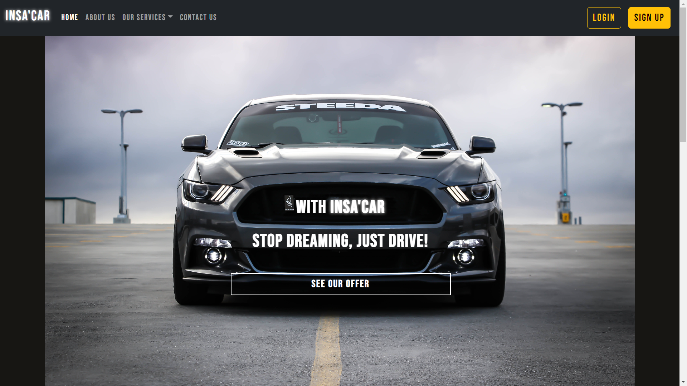

<!-- PROJECT LOGO -->
 

  

  <h1 align="center">Project Application</h1>

<!-- TABLE OF CONTENTS -->

  
Table of Contents

  <ol>
    <li>
      <a href="#about-the-project">About The Project</a>
      <ul>
        <li><a href="#built-with">Built With</a></li>
      </ul>
    </li>
  </ol>

<!-- ABOUT THE PROJECT -->
## About The Project

This is the project web application which is built in 7 days by 5 third-year engineering students at INSA Centre Val de Loire, Campus Bourges, France - Promotion 2019-2024.

INSA'CAR is a rental car-like website with security payment. Centralize the nessesary aspect of security in domain web development nowadays.

### Built With

* [Stripe - 3rd party payment](https://stripe.com/)
* [Bootstrap](https://getbootstrap.com)
* [JQuery](https://jquery.com)
* [HTML/CSS/JS]()
* [PHP](https://www.php.net/)
* [MySQL - DATABASE](https://www.mysql.com/)

### Security Tool

* [Acunetix Pro](https://www.acunetix.com)
* [NetSparker](https://www.php.net/)
* [OWASP ZAP](https://detectify.com)

### Injection Test
* [sqlmap](https://sqlmap.org/)

### Deployment

* [PlanetHoster](https://www.planethoster.com/)

(<a href="#top">back to top</a>)

